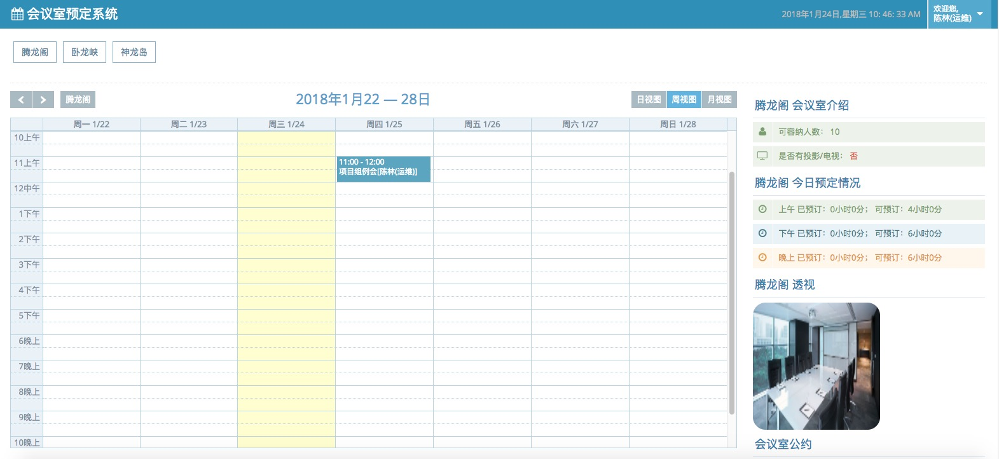
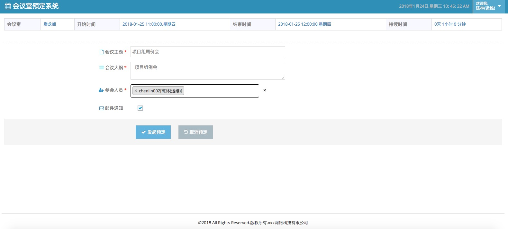
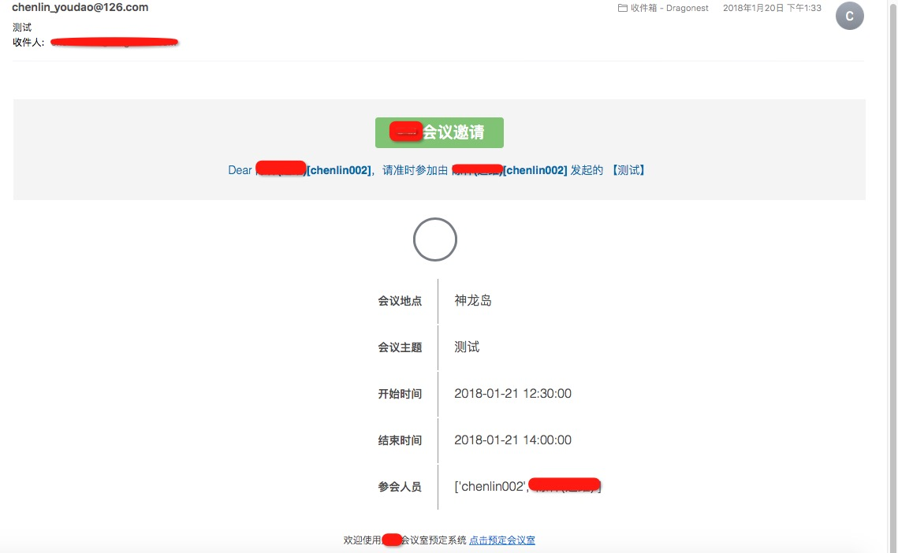

## 简介
    
    基于django2.0的会议室预定系统， 采用django restful接口加vue的方式实现前后端交互

## 基础功能

 + 预定会议室
 + 会议邀约
    
## 使用技术
 
 + Django2.0
 + Vue
 + Jquery
 + MySQL
    
## 部署环境变量
    # 表明生产环境
    PROD = 1
    # 数据库环境变量
    DATABASE_NAME = "db_bootmeeting"
    DATABASE_USER = "DATABASE_USER"
    DATABASE_HOST = "127.0.0.1"
    DATABASE_PORT = 13306
    DATABASE_PASSWORD = "root"
    
    # 邮件相关环境变量
    EMAIL_SENDER = 'xxxx@126.com'
    EMAIL_USE_TLS = False
    EMAIL_HOST = 'smtp.126.com'
    EMAIL_PORT = 25
    EMAIL_HOST_USER = 'xxxx@126.com'
    EMAIL_HOST_PASSWORD = 'xxxx'
    
    # 其他，这个是用于从OA进行用户同步, 同步的数据写入到User表
    OA_DB_HOST = ''
    OA_DB_USER = ''
    OA_DB_PORT = 3306
    OA_DB_PASSWORD = ''
    OA_DB_NAME = 'oa'
    
    
## 运行

    python manage.py runserver 8080
    python manage.py crontab add
    
    
## 说明

    由于这是针对本公司的会议室预定系统开源版本，由于用户来自OA系统，无法切割用户的姓氏，所以用户的中文名字存入的是User表的first_name
    字段，可根据实际情况修改，预定完成后会自动邮件通知参会人员
    
## 预览

### 登录

    
    
### 预定
    
    

### 邮件通知

